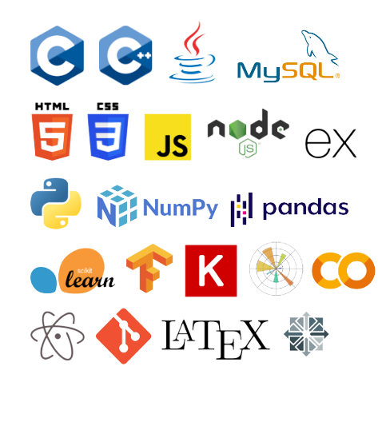

<!-- Shree Ganeshay Namah ! -->

<!--  
  -->
 

  
  &#8287;&#8287;&#8287;&#8287;&#8287; &#8287;<!-- for spacing between icons -->
  
  &#8287;&#8287;&#8287;&#8287;&#8287;&#8287;
  
  &#8287;&#8287;&#8287;&#8287;&#8287;
  
  <H1 align="center"> Greetings ! 👋</H1> 
  <H3 align="center"></H3>
  
<!--    -->

  
  <!--     -->
   
  
I am an aspiring computer science engineer, currently in my prefinal year. I have a vehement passion to customise and tinker with technology be it software or hardware :monocle_face:. Always on the voyage to explore :surfing_man: new stuff in the Science and Technology domain. Looking forward to add value :smile: and give back to the community here on GitHub :v:. 
  
More about me :man_technologist: ......  

 I am presently studying Deep Learning :chart_with_upwards_trend:.
  
 I have an interest in writing blogs. My aim is to increase my consistency by publishing :bookmark_tabs: more in the future.

  I am ambitious about learning MLOps. Would love to work on related projects sometime soon.
  
 Wanna play some duos ? Catch me playing Fortnite :joystick: @ *VRDPumpkinLemons*.  

 

  <h2>Github stats</h2>

  
  
  

 
 
 

<!-- Hello future me, these points are gonna help for your confusions:

      1. The fine lines after "Greetings" and "Github Stats" are coming because of H1 and H2 tags...won't come after H3 and beyond. I haven't found an alternative            for them.......yet :p
      2. Markdown codes in case the ned arises:
         
         

          <!-- 
-->

<!--
**VinayakRaoDikshit/VinayakRaoDikshit** is a ✨ _special_ ✨ repository because its `README.md` (this file) appears on your GitHub profile.

Here are some ideas to get you started:

- 🔭 I’m currently working on ...
- 🌱 I’m currently learning ...
- 👯 I’m looking to collaborate on ...
- 🤔 I’m looking for help with ...
- 💬 Ask me about ...
- 📫 How to reach me: ...
- 😄 Pronouns: ...
- ⚡ Fun fact: ...
 https://github.com/anuraghazra/github-readme-stats#responsive-card-theme
-->
